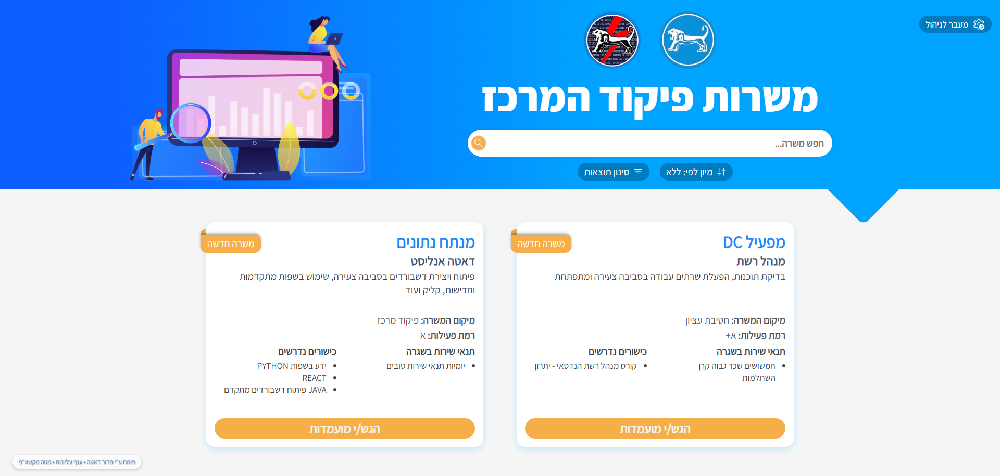
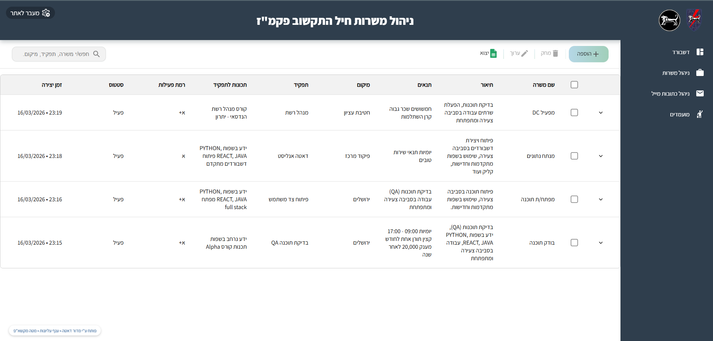
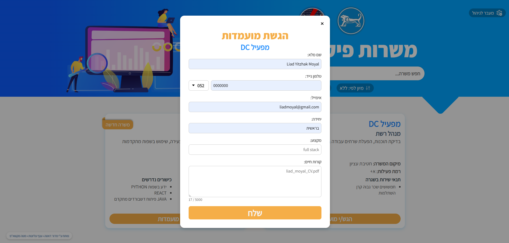
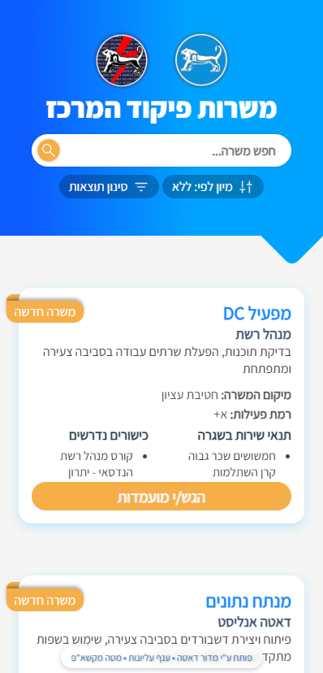

# 📋 PakmazJobs — IDF Permanent Positions Portal

A full-stack internal web platform built for the IDF Central Command, enabling HR officers to publish permanent job openings and soldiers to browse and apply — all in one place.

> Built and deployed during my service in the IDF Data Division (Mador Data), as part of the Beresheet tech team. Actively used by 500+ personnel across the command.

---

## 🎯 The Problem It Solves

Before this system, job openings for permanent IDF positions were managed manually — spreadsheets, emails, and physical notices. HR officers had no central way to publish openings, and soldiers had no easy way to discover or apply.

This platform replaced that entire workflow.

---

## ✨ Features

### Soldier-Facing Portal
- Browse and filter open positions
- Submit job applications directly through the platform
- Mobile-responsive — works on any device

### HR Admin Dashboard
- Create, edit, publish, and close job listings
- View and manage all incoming applications per listing
- Analytics dashboard with key recruitment metrics
- Export applicant data to Excel with one click
- Built-in mailing list — send email updates to applicants

### System & Infrastructure
- **Role-based access control** — strict separation between soldier and HR views
- **JWT authentication** — protected routes with admin middleware
- **Full request logging** — logger + error logger + user activity tracker middleware
- **Dockerized** — runs with a single `docker compose up`

---

## 🖼️ Screenshots

### Desktop

<div align="center">

| Job Listings | HR Dashboard |
|:---:|:---:|
|  |  |

| Application Form |
|:---:|
|  |

</div>

### Mobile

<div align="center">
  
  <br/>
  <em>Fully responsive — optimized for soldiers accessing from mobile</em>
</div>

---

## 🛠️ Tech Stack

| Layer | Technology |
|---|---|
| Frontend | React, JavaScript, CSS Modules |
| Backend | Node.js (Express) |
| Database | PostgreSQL |
| Auth | JWT + role-based middleware |
| Email | Nodemailer (mailing list & notifications) |
| Export | Excel generation |
| Containerization | Docker, Docker Compose |
| Deployment | IDF internal network |

---

## 🏗️ Architecture

```
pakmazJobs/
├── client/                  # React frontend
│   └── src/
│       ├── components/      # UI components (18 components)
│       ├── pages/           # JobsPage, AdminPage
│       ├── services/api/    # API layer (jobs, applicants, excel, email...)
│       ├── styles/          # CSS Modules per component
│       └── utility/         # Shared helpers
├── server/                  # Node.js backend
│   ├── routes/              # 7 route modules
│   ├── controllers/         # Business logic per domain
│   ├── middleware/          # auth, admin, logger, errorLogger, activityLogger
│   ├── db/                  # PostgreSQL schema + seed data
│   └── utils/               # logger, sqlErrorHandler
└── docker-compose.yaml      # One-command setup
```

The backend exposes a REST API consumed by the React frontend.
All data (jobs, applications, users, emails) is persisted in PostgreSQL.
Five middleware layers handle auth, admin access, and full request/error/activity logging.

---

## 🚀 Getting Started

### Option A — Docker (Recommended)

```bash
git clone https://github.com/liadmoyal/job-portal.git
cd pakmazJobs
cp .env.example .env        # fill in your credentials
docker compose up --build
```

App will be running at `http://localhost:3000`

### Option B — Manual

#### Prerequisites
- Node.js v18+
- PostgreSQL 14+

```bash
git clone https://github.com/liadmoyal/job-portal.git
cd pakmazJobs

# Frontend
cd client && npm install

# Backend
cd ../server && npm install

# Database
psql -U postgres -f db/schema.sql

# Start
npm run dev
```

---

## 📡 API Reference

### Jobs
| Method | Endpoint | Access | Description |
|---|---|---|---|
| `GET` | `/api/jobs` | Public | Get all open positions |
| `POST` | `/api/jobs` | HR only | Create a new listing |
| `PUT` | `/api/jobs/:id` | HR only | Update a listing |
| `DELETE` | `/api/jobs/:id` | HR only | Remove a listing |

### Applications
| Method | Endpoint | Access | Description |
|---|---|---|---|
| `POST` | `/api/applications` | Soldier | Submit an application |
| `GET` | `/api/applications` | HR only | Get all applications |
| `GET` | `/api/applications/:jobId` | HR only | Applications for a specific job |

### Users & Auth
| Method | Endpoint | Access | Description |
|---|---|---|---|
| `POST` | `/api/users/login` | Public | Authenticate + receive JWT |
| `GET` | `/api/users` | Admin | Get all users |

### Admin Dashboard
| Method | Endpoint | Access | Description |
|---|---|---|---|
| `GET` | `/api/dashboard` | Admin | Recruitment metrics & analytics |

### Email & Mailing List
| Method | Endpoint | Access | Description |
|---|---|---|---|
| `GET` | `/api/emails` | Admin | Get mailing list |
| `POST` | `/api/emails` | Admin | Add to mailing list |
| `POST` | `/api/send-email` | Admin | Send email to applicants |

### Excel Export
| Method | Endpoint | Access | Description |
|---|---|---|---|
| `GET` | `/api/excel/applications` | Admin | Export applicants to `.xlsx` |

---

## 💡 What I Learned Building This

- Designing a relational DB schema from scratch — users, jobs, applications, roles, mailing lists
- Building a REST API that serves two completely different user types from the same backend, with middleware enforcing access at every layer
- Structuring a React app with CSS Modules and a clean service/API layer instead of mixing concerns
- Real client work — working directly with HR officers and commanders, understanding that what users *ask for* and what they *need* are often different things
- The gap between "it works locally" and deploying to a real, secured internal network
- Why logging matters — the activity logger and error logger saved hours of debugging in production

---

## 👤 Author

**Liad Yitzhak Moyal** — Full-Stack Developer
- GitHub: [@liadmoyal](https://github.com/liadmoyal)
- LinkedIn: [linkedin.com/in/liadmoyal](https://linkedin.com/in/liadmoyal)
- Email: liadmoyal@gmail.com

---

*Built as part of IDF service — source code is not publicly available for security reasons.*
