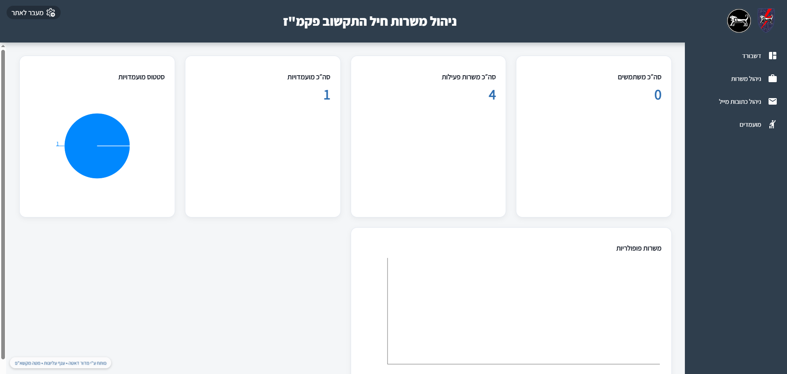

# Job-Portal-demo
A full-stack internal web platform built for the IDF Central Command, enabling HR officers to publish permanent job openings and soldiers to browse and apply — all in one place.

> Built and deployed during my service in the IDF Data Division (Mador Data), as part of the Beresheet tech team.

---

## 🎯 The Problem It Solves

Before this system, job openings for permanent IDF positions were managed manually — spreadsheets, emails, and physical notices. HR officers had no central way to publish openings, and soldiers had no easy way to discover or apply to them.

This platform replaced that entire workflow.

---

## ✨ Features

- **Soldier-facing portal** — Browse open positions and submit applications
- **HR Dashboard** — Officers can create, edit, and manage job listings
- **Application tracking** — HR can view and manage incoming applications per listing
- **Secure access** — Role-based access control separating HR and soldier views
- **Responsive UI** — Works across desktop and mobile

---

## 🖼️ Screenshots


| Job Listings | HR Dashboard | Application Form | Jobs Managment | MobileHome |
|---|---|---|
|  |  |  |   |  |

---

## 🛠️ Tech Stack

| Layer | Technology |
|---|---|
| Frontend | React, JavaScript, HTML, CSS |
| Backend | Node.js, Java |
| Database | PostgreSQL |
| Auth | Role-based (HR / Soldier) |
| Deployment | IDF internal network |

---

## 🏗️ Architecture

```
├── client/          # React frontend
│   ├── components/
│   ├── pages/
│   ├── styles/      # css modules
│   └── services/    # API calls
├── server/          # Node.js backend
│   ├── routes/      # REST API endpoints
│   ├── controllers/
│   ├── middleware/
│   └── db/          # PostgreSQL models & queries
└── java-service/    # Java backend layer
```

The backend exposes a REST API consumed by the React frontend. PostgreSQL handles all persistent data — job listings, applications, and user records.

---

## 🚀 Getting Started

### Prerequisites
- Node.js v18+
- PostgreSQL 14+
- Java 11+

### Installation

```bash
# Clone the repo
git clone https://github.com/liadmoyal/job-portal.git
cd job-portal

# Install frontend dependencies
cd client
npm install

# Install backend dependencies
cd ../server
npm install

# Set up environment variables
cp .env.example .env
# Fill in your DB credentials in .env

# Set up the database
psql -U postgres -f db/schema.sql

# Run the app
npm run dev         # starts both client and server
```

The app will be running at `http://localhost:3000`

---

## 📡 API Overview

| Method | Endpoint | Description |
|---|---|---|
| GET | `/api/jobs` | Get all open positions |
| POST | `/api/jobs` | Create a new listing (HR only) |
| GET | `/api/jobs/:id` | Get single job details |
| POST | `/api/jobs/:id/apply` | Submit an application |
| GET | `/api/applications` | Get all applications (HR only) |

---

## 💡 What I Learned Building This

- Designing a relational DB schema from scratch (users, jobs, applications, roles)
- Building a REST API that serves two completely different user types from the same backend
- Working directly with end-clients (HR officers and commanders) to understand real requirements — not assumed ones
- The gap between "it works on my machine" and deploying to a real internal network

---

## 👤 Author

**Liad Yitzhak Moyal** — Full-Stack Developer
- GitHub: [@liadmoyal](https://github.com/liadmoyal)
- LinkedIn: [linkedin.com/in/liadmoyal](https://linkedin.com/in/liadmoyal)
- Email: liadmoyal@gmail.com

---

*Built as part of IDF service — source code is not publicly available for security reasons.*
